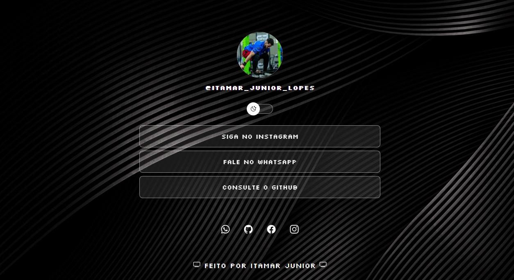
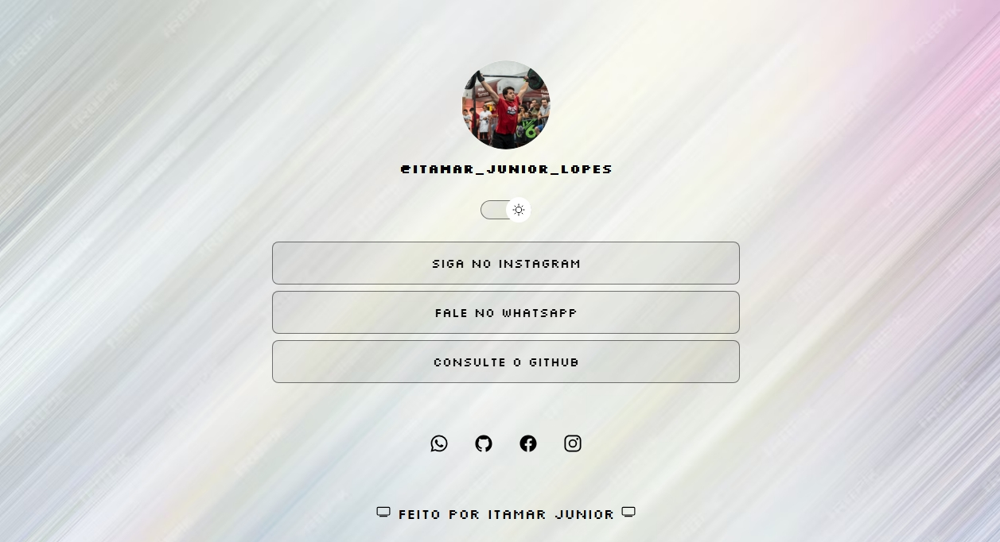

# 🧪 Primeiro Projeto

Este é o meu primeiro projeto front-end publicado com GitHub Pages. O objetivo foi praticar a estrutura básica de um site utilizando **HTML**, **CSS** e **JavaScript**, além de aprender como hospedar um projeto no GitHub Pages.

---

## 🚀 Acesse o Projeto

Você pode ver o site publicado aqui:  
🔗 [Clique para acessar](https://itamarjrrx.github.io/Primeiro-projeto-/)

---

## 📸 Layout




---

## ✨ Funcionalidades

- ✅ **Alternância de tema (claro/escuro)**: O site muda automaticamente entre os temas conforme o modo do navegador ou por interação do usuário.
- 🧑‍💼 **Sessão de apresentação pessoal**: Inclui uma breve introdução com seu nome, profissão e objetivos.
- 🖼️ **Foto de perfil**: A imagem se adapta conforme o tema (claro/escuro).
- 🧭 **Design responsivo**: A estrutura da página se adapta a diferentes tamanhos de tela (desktop e celular).
- 🖋️ **Estilo customizado com CSS**: Estilização própria para cores, fontes e layout geral.
- ⚙️ **Scripts em JavaScript**: Utilização de JS para manipulação dinâmica da página, como troca de imagem de perfil.

## 🛠️ Tecnologias Utilizadas

- HTML5
- CSS3
- JavaScript
- Git & GitHub
- GitHub Pages (para publicação)

---

## 📂 Estrutura de Pastas

```plaintext
├── index.html
├── style.css
├── script.js
├── Meuassets/
│   └── (imagens, ícones, etc.)
├── README.md

## ✍️ Autor

Feito com 💻 por **Itamar Junior (RX)**  
📧 Contato: [psnjunior-@hotmail.com].